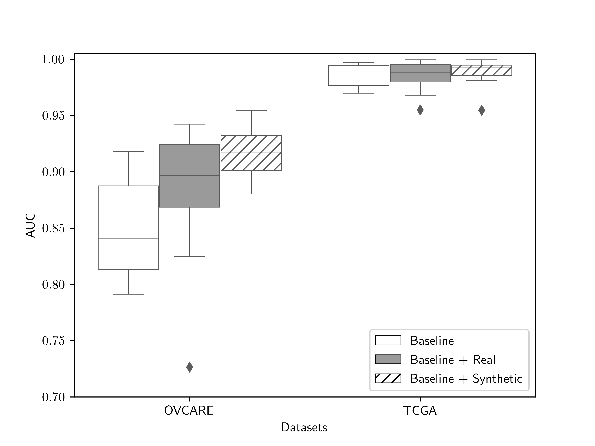

# Synthesis of diagnostic quality cancer pathology images: Classification component

This is the implementation of our evaluation experiments for both OVCARE and TCGA dataset of [Synthesis of diagnostic quality cancer pathology images](https://onlinelibrary.wiley.com/doi/abs/10.1002/path.5509). 

# Motivation
We trained deep convolutional neural networks (CNNs) to diagnose the different cancer types and
determined that the synthetic images perform as well as additional real images when used to
supplement a small training set.

# Workflow

For evaluating the utility of synthetic images as data augmentation, we trained deep learning classifiers to differentiate ovarian carcinoma subtypes as well as five cancer histotypes from TCGA. Each image classifier was trained and tested on an additional set of 52 (ovarian) and 108 (TCGA) WSIs that were not included in the training set of the GANs.

The VGG19 network46 with batch normalization was chosen for the classifier based on its ease of use and robust performance. Classification results are reported on the testing set using the weights of the VGG19 model taken from the training epoch with the highest validation accuracy.

# Results

Multi-class area under the receiver operator
curve for classifiers trained on the baseline training set, and training sets augmented with real
images or with synthetic images. There was a statistically significant improvement in
performance between the OVCARE baseline and baseline + synthetic image datasets (p=0.0009).